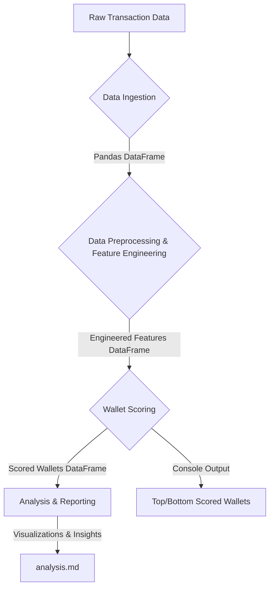

# Aave V2 Wallet Credit Scoring Project

## 1. Introduction

This project addresses a critical need in the decentralized finance (DeFi) ecosystem: assessing the creditworthiness and reliability of user wallets based purely on their on-chain transaction history. Specifically, this model focuses on interactions with the Aave V2 lending protocol. The primary objective is to assign a "credit score" ranging from 0 to 1000 to each unique wallet. A higher score signifies a user demonstrating reliable, responsible, and consistent engagement, while a lower score may indicate sporadic, risky, bot-like, or potentially exploitative behavior.

Unlike traditional finance, where credit scores are derived from centralized financial institutions and personal data, DeFi operates on transparent and immutable public ledgers. This project leverages this transparency to infer a wallet's "creditworthiness" by analyzing its historical actions, providing a foundation for risk assessment, user segmentation, and targeted incentives within the Aave ecosystem.

## 2. Project Architecture and Processing Flow

The project is structured into distinct, modular components, ensuring clarity, maintainability, and extensibility. The overall flow transforms raw transaction data into actionable credit scores and insightful analysis.

### 2.1. Overall Architecture

The diagram below illustrates the high-level architecture and data flow within the project:



### 2.2. Detailed Processing Flow

Each stage of the pipeline is implemented within `src/aave_wallet_scorer.py` and contributes to the final output:

1.  **Data Ingestion (`main` function):**

      * **Purpose:** To load the raw transaction data into a usable format for processing.
      * **Mechanism:** The project expects a JSON file (`user-wallet-transactions.json`) containing an array of transaction records. Each record is a dictionary with details like `timestamp`, `userWallet`, `protocol`, `action`, and `actionData` (which includes `amount` and `assetPriceUSD`).
      * **Output:** A list of Python dictionaries, which is then immediately converted into a Pandas DataFrame for efficient data manipulation in subsequent steps. Robust error handling is included to manage `FileNotFoundError` or `JSONDecodeError`.

2.  **Data Preprocessing & Feature Engineering (`extract_features` function):**

      * **Purpose:** To transform granular, transaction-level data into aggregated, meaningful behavioral features for each unique wallet. This is the most crucial step for capturing "credit-like" signals from raw blockchain activity.
      * **Key Operations:**
          * **Timestamp Conversion:** Raw Unix timestamps are converted to readable `datetime` objects, enabling time-based calculations (e.g., transaction intervals, active days).
          * **USD Value Calculation:** The `usd_amount` for each transaction is computed by multiplying `actionData['amount']` by `actionData['assetPriceUSD']`. This normalizes transaction values across different crypto assets.
          * **Wallet Grouping:** The DataFrame is grouped by `userWallet` to process transactions on a per-wallet basis.
          * **Feature Calculation:** For each wallet group, a comprehensive set of features is derived:
              * **Activity Metrics:** `txn_count` (total transactions), `active_days` (unique days with activity), `txn_frequency_per_active_day` (transactions per active day), `wallet_age_days` (duration from first to last transaction). These capture the intensity and longevity of engagement.
              * **Volume Metrics:** `total_usd_volume` (total value transacted), `avg_txn_value` (average transaction size), `avg_daily_usd_volume` (average volume per active day). These reflect the economic scale of interaction.
              * **Consistency Metrics:** `std_txn_interval` (standard deviation of time between transactions), `min_txn_interval`, `max_txn_interval`. Lower standard deviation suggests more predictable or consistent behavior, which is often desirable.
              * **Engagement Diversity:** `unique_protocols` (number of distinct protocols, though likely 1 for this Aave-specific dataset), `unique_actions` (e.g., deposit, borrow, repay). Diversity indicates a more holistic use of the protocol's features.
              * **Financial Health/Risk Indicators:**
                  * `net_usd_flow`: An approximation of net financial movement (deposits + repays - borrows - redemptions). A positive flow suggests a net liquidity provider.
                  * `deposit_count`, `borrow_count`, `repay_count`: Raw counts of specific actions.
                  * `repay_to_borrow_ratio`: The ratio of repay actions to borrow actions. A higher ratio (especially \>1) is a strong indicator of responsible debt management.
                  * `has_been_liquidated`: A binary flag (1 if a `liquidationcall` occurred, 0 otherwise). This is a critical direct indicator of financial distress.
      * **Output:** A Pandas DataFrame where each row represents a unique `userWallet` and its calculated features. Missing values or infinite values (e.g., from division by zero for wallets with single transactions) are handled by filling with zeros.

3.  **Wallet Scoring (`score_wallets` function):**

      * **Purpose:** To aggregate the engineered features into a single, interpretable credit score between 0 and 1000.
      * **Mechanism:**
          * **Min-Max Normalization:** All selected features are scaled to a range between 0 and 1 using `sklearn.preprocessing.MinMaxScaler`. This prevents features with larger numerical ranges (e.g., `total_usd_volume`) from dominating the score over features with smaller ranges (e.g., `unique_actions`).
          * **Weighted Sum:** A heuristic approach is employed where each normalized feature is multiplied by a predefined weight. These weights reflect the perceived importance of each behavior in determining "creditworthiness" in a DeFi context.
          * **Inversion for Negative Indicators:** For features where a *lower* value is considered "better" (e.g., `std_txn_interval`, `has_been_liquidated`), their normalized value is inverted (`1 - scaled_value`) before being multiplied by their weight. This ensures they contribute positively to the final score when they indicate desirable behavior.
          * **Final Scaling:** The sum of these weighted components, which initially falls within a 0-1 range (assuming weights sum to 1), is then scaled to an integer between 0 and 1000 and clipped to ensure it stays within these bounds.
      * **Output:** A Pandas DataFrame with two columns: `wallet` (the user's address) and `score` (their calculated credit score), sorted in descending order of score for easy review.

4.  **Analysis & Reporting (`analysis.md` and Jupyter Notebook):**

      * **Purpose:** To interpret the generated scores, understand their distribution, and characterize the behavioral patterns of wallets across different score ranges.
      * **Mechanism:** This involves:
          * **Descriptive Statistics:** Summarizing the score distribution (mean, median, standard deviation, min, max).
          * **Visualizations:** Generating histograms to show the overall score distribution and bar plots to show wallet counts in specific score ranges (e.g., 0-100, 101-200, etc.). Scatter plots are used to illustrate the relationship between key features and the final score.
          * **Comparative Analysis:** Comparing the average feature values of high-scoring wallets (e.g., top 5%) versus low-scoring wallets (e.g., bottom 5%) to validate that the model is indeed capturing the intended behavioral differences.
      * **Output:** The `analysis.md` file (this document's companion) provides a narrative explanation of these findings, along with references to the visualizations generated in a Jupyter Notebook environment.

## 3\. Methodology Chosen: Heuristic Scoring Logic

The core of this credit scoring model lies in its heuristic approach, where expert knowledge (or common understanding of "good" DeFi behavior) is translated into quantifiable features and their relative importance (weights).

### 3.1. Detailed Feature Rationale

Each engineered feature is selected to capture a specific aspect of a wallet's interaction with the Aave V2 protocol, contributing to its overall credit assessment:

  * **`txn_count` (Total Transactions):** A fundamental measure of activity. More transactions generally imply greater engagement.
  * **`total_usd_volume` (Total USD Value Transacted):** Represents the economic scale of the wallet's operations. High volume suggests a more significant participant.
  * **`avg_txn_value` (Average Transaction Value):** Differentiates between many small transactions (e.g., micro-interactions, potential bot) and fewer large, impactful transactions.
  * **`unique_protocols` (Number of Unique Protocols):** While mostly 'AaveV2' in this dataset, in a broader context, diversity could indicate a well-rounded DeFi user or, conversely, a spread of risk.
  * **`unique_actions` (Number of Unique Action Types):** Measures the breadth of interaction (e.g., deposit, borrow, repay, redeem). A wallet using multiple functionalities is often seen as more engaged and less specialized (like a flash loan bot).
  * **`active_days` (Number of Unique Active Days):** Indicates the consistency and spread of activity over time. A wallet active on many different days is less likely to be a one-off exploiter.
  * **`txn_frequency_per_active_day` (Transactions per Active Day):** Captures the intensity of activity during periods of engagement. High frequency can suggest active management, but extremely high frequency might also hint at bot activity.
  * **`std_txn_interval` (Standard Deviation of Transaction Intervals):** A measure of consistency. Lower standard deviation implies more regular or predictable transaction timing, which is generally a positive signal for reliability.
  * **`min_txn_interval` & `max_txn_interval`:** Provide insights into the extremes of transaction timing, which can help identify very rapid (potentially bot) or very infrequent patterns.
  * **`wallet_age_days` (Age of Wallet Activity):** Longevity of interaction is a strong indicator of a stable, long-term user, akin to credit history length.
  * **`avg_daily_usd_volume` (Average Daily USD Volume):** Combines volume and activity spread, showing consistent economic contribution.
  * **`net_usd_flow` (Approximate Net USD Flow):** Estimates whether a wallet is a net supplier of liquidity (positive flow) or a net borrower/withdrawer (negative flow). Positive flow is generally a sign of health.
  * **`deposit_count`, `borrow_count`, `repay_count`:** Raw counts of core lending actions.
  * **`repay_to_borrow_ratio` (Repayments to Borrowings Ratio):** A crucial indicator of debt management discipline. A ratio significantly greater than 1 implies responsible repayment behavior.
  * **`has_been_liquidated` (Liquidation Flag):** A binary indicator of whether the wallet has ever had a `liquidationcall`. This is a strong negative signal, as liquidation implies a failure to maintain collateral requirements.

### 3.2. Weighted Sum Scoring and Interpretation

After feature engineering, the values are scaled to a common range (0 to 1) using `MinMaxScaler`. This prevents features with naturally larger magnitudes from disproportionately influencing the final score.

The core scoring is then a **weighted sum** of these normalized features. The weights are assigned based on their perceived importance for a "responsible" DeFi user:

| Feature                        | Weight | Rationale for Weighting                                                                                                                              |
| :----------------------------- | :----- | :--------------------------------------------------------------------------------------------------------------------------------------------------- |
| `txn_frequency_per_active_day` | 0.20   | High weight as consistent and frequent engagement within active periods is a strong positive signal for a reliable user.                           |
| `unique_actions`               | 0.15   | Rewards wallets that fully utilize the protocol's features, indicating broader, more legitimate engagement.                                         |
| `total_usd_volume`             | 0.15   | Significant economic activity is a primary indicator of a valuable and engaged participant.                                                          |
| `wallet_age_days`              | 0.10   | Longevity implies stability and commitment to the protocol, reducing the likelihood of short-term exploitative behavior.                             |
| `avg_daily_usd_volume`         | 0.10   | Reinforces `total_usd_volume` by emphasizing consistent daily economic contribution, not just one-off large transactions.                          |
| `net_usd_flow`                 | 0.10   | A positive net flow suggests the wallet is a net contributor of liquidity or manages its debt well, which is beneficial for the protocol.         |
| `repay_to_borrow_ratio`        | 0.10   | Crucial for lending protocols; a high ratio directly indicates responsible borrowing and debt management.                                            |
| `active_days`                  | 0.05   | A broader spread of activity over time (more active days) is better than concentrated bursts.                                                        |
| `txn_count`                    | 0.05   | General measure of overall activity; complements frequency and volume.                                                                               |
| `std_txn_interval` (inverted)  | 0.05   | Lower standard deviation (more consistent timing) is preferred, as erratic patterns can sometimes indicate bot or arbitrage activity.               |
| `has_been_liquidated` (inverted)| 0.05   | A direct penalty for failing to maintain collateral; a strong negative indicator of risk management.                                               |

The final score, ranging from 0 to 1000, can be interpreted as follows:

  * **High Score (700-1000):** These wallets are exemplary users. They exhibit high transaction volume, frequent and consistent activity, diverse engagement with protocol features, responsible debt management (high repay-to-borrow ratio, positive net flow), and have never faced liquidation. They are likely long-term, reliable participants.
  * **Mid Score (300-699):** This range represents the majority of users. They show moderate activity, volume, and engagement. While generally responsible, they might have less consistent patterns, lower overall volume, or less diverse actions compared to top-tier wallets.
  * **Low Score (0-299):** These wallets often show minimal activity, very low volume, highly inconsistent transaction timing, or a history of liquidation. This segment might include dormant accounts, one-time users, or potentially risky/exploitative entities.

## 4\. How to Run the Project

To set up and execute the Aave V2 Wallet Credit Scoring project, follow these steps:

1.  **Clone the Repository:**
    Begin by cloning this GitHub repository to your local machine:

    ```bash
    git clone [https://github.com/YourUsername/aave-wallet-scoring.git](https://github.com/YourUsername/aave-wallet-scoring.git)
    cd aave-wallet-scoring
    ```

    *(Remember to replace `YourUsername` with your actual GitHub username or the repository's owner.)*

2.  **Place Data File:**
    Ensure that your raw transaction data file, named `user-wallet-transactions.json`, is placed inside the `data/` directory within the cloned repository.
    The expected path for the script is `aave-wallet-scoring/data/user-wallet-transactions.json`.

3.  **Create and Activate Virtual Environment (Recommended):**
    It's best practice to work within a Python virtual environment to manage dependencies and avoid conflicts with other projects.

    ```bash
    python -m venv venv
    # On macOS/Linux:
    source venv/bin/activate
    # On Windows:
    .\venv\Scripts\activate
    ```

4.  **Install Dependencies:**
    All necessary Python libraries are listed in `requirements.txt`. Install them using pip:

    ```bash
    pip install -r requirements.txt
    ```

5.  **Run the Scoring Script:**
    Execute the main Python script from the project's root directory:

    ```bash
    python src/aave_wallet_scorer.py
    ```

    The script will load the data, engineer features, calculate scores, and print the top 10 and bottom 10 scored wallets directly to your console.

6.  **View Detailed Analysis:**
    For a comprehensive understanding of the score distribution, wallet behavior characteristics across different ranges, and supporting visualizations, refer to the `analysis.md` file located in the repository's root.
    To generate the actual plots mentioned in `analysis.md` (e.g., histograms, scatter plots), you can run the code snippets provided within a Jupyter Notebook environment. To start a Jupyter Notebook server:

    ```bash
    jupyter notebook
    ```

    Then, create a new notebook or open an existing one, and copy-paste the relevant code sections from `analysis.md` or the original Jupyter notebook used for development.

## 5\. Dependencies

The following Python libraries are required to run this project. They are listed in `requirements.txt` for easy installation:

  * `pandas`: For data manipulation and analysis.
  * `scikit-learn`: For data scaling (`MinMaxScaler`).
  * `matplotlib`: For creating static visualizations (histograms, scatter plots).
  * `seaborn`: Built on Matplotlib, for enhanced statistical data visualizations.
  * `numpy`: For numerical operations, especially within Pandas and for handling potential `inf` values.

<!-- end list -->

```
```
